

# Introduction

At its heart the idea of Rate Limiting is basically putting an upper limit on the number
of calls a particular caller (user/client/organization) can make on our
api endpoints within a certain time interval. So in essence it is about
setting the allowed call rates on our api endpoints whether at a
indivdual or more general level thereby trying to ensure a fair
distribution of our system resources and preventing any one client or
user from abusing the system. 

You can read more about the concepts here in http://tech.domain.com.au/2017/11/protect-your-api-resources-with-rate-limiting/

The libraries in this repo provide distributed implementations of rate limiting using Redis for the following algorithms:

* SteppingTimeWindow
* SlidingTimeWindow
* LeakyBucket

Also they
allow multiple call rates to be specified for four different time units of seconds, minutes, hours and
days allowing a single endpoint to be limited at multiple levels like allowing 60 calls per min but no
more than 100 calls per hour. Also you can also define your own custom period if you need more flexibility 
like allowing 60 calls every 10 seconds.

Both WebApi and AspnetCore versions are included.

# Getting started

First we need to reference the following packages from Nuget:
(NOTE: All the packages are in alpha version now so please make sure to check the "Include prerelease" checkbox in the Nuget Package Manager while searching in Nuget)
* For AspnetCore apps: install the Domain.RateLimiting.AspNetCore package which contains the rate limiting filter which works     with Domain.RateLimiting.Core (skip for WebApi/Owin projects)
* For WebApi/Owin projects: install the Domain.RateLimiting.WebApi package which contains the rate limiting filter which works with Domain.RateLimiting.Core (Skip for AspnetCore projects)
* Domain.RateLimiting.Redis package which provides a distributed 
  Redis implementation of the IRateLimitingCacheProvider from the Domain.RateLimiting.Core package meaning 
  that it can be used from multiple servers which is more suiting to real
  production environments. This is the package that keeps track of the call count per time window and 
   gives a go or no go based on the number of calls made so far.        Currently it provides implementations for both Fixed Window and the more accurate and burst free Sliding Window algorithms. You can use  
   either one or even add your own implementation by implementing the IRateLimitingCacheProvider.

### Now we are ready to start limiting and protecting our application endpoints.

The first thing we need to understand is the **IRateLimitingPolicyProvider** which has only one method with signature

	Task<RateLimitPolicy> GetPolicyAsync(RateLimitingRequest rateLimitingRequest)

As seen it gets passed in a RateLimitingRequest instance as parameter which decribes the context of the current request. The RateLimitingRequest class exposes the following properties: 

* RouteTemplate: the route template that the current request path matches with. For example a GET request nade to the url 
    api/values/1 falls under the route template api/values/{id} and will be mapped to the action in a controller that has this Route defined
    on it. Also the request for api/values/2 will be mapped to the same action via the same route template and rate limiting should be applied on the route template rather than the path which is an instance of the route template. It is the route template that identifies an endpoint on a general level. If you set a rate limit on api/values/{id} for let us say 10 calls PerMinute then any call made to that endpoint with whatever value for the {id} part will counted as a call to api/values/{id} and moreover whatever value we put in the {id} part, we will get to make only 10 calls PerMinute    
* Path: the actual url path the request was made to for instance api/values/1 or api/values/2 which can be thought of as an instance of a route template
* HttpMethod: the http method the request was with like GET, PUT, POST, DELETE, etc
* GetHeaders: this method takes a string header name and returns the value of that header from the current request. This can be used by the IRateLimitingPolicyProvider implementation to inspect any header from the current request to decide which policy to apply to the current request 
* ClaimPrinciple: the authenticated user/client making the current request. We can extract the userid/clientid or any other claim from this property and later use it apply a particular rate limit on the current request.
* InputStream: the body of the request as a stream to let the implementation a chance to examine the body if required to help it make its decision on what rate limit to apply to the current request

The idea is that for every request the framework will ask the implementation of **IRateLimitingPolicyProvider** for the RateLimitPolicy to apply to that request and the 
implementation can supply a suitable policy based on the request context information provided to it. It can also consult any other sources to make the decision as it sees fit. 

The RateLimitPolicy provided contains:
	    
* RequestKey: the key that we want to apply the rate limiting on. This parameter must be provided and exceptions will be throw otherwise. We can supply any value here to differentiate the requests for the same endpoint. For instance if we set a rate limiting policy of 10 calls PerMinute on the endpoint api/values/{id}, we usually would like to apply this on a per user/client basis other than as a whole for everybody. For this kind of situations we can extract the userid/clientid from the current request (represented by RateLimitingRequest)
    and set the RequestKey to that value to apply rate limiting separately for each client or user. We can supply any value here as needed to group requests counts under a particular RequestKey and apply the rate limiting on each group separately
* RouteTemplate: the route template or group that we would like to file the current request under as far as rate limiting is concerned. This can be the same RouteTemplate as the one supplied by the input RateLimitingRequest or can be different as needed. For instance if a request if coming for routeTempalte api/values/{id}, we can set the same value in the RateLimitPolicy that we return to show our intent that given a request coming for the endpoint api/values/{id}, we would like to apply a rate limiting count on that specific routeTemplate. We could have done something totally different as well based on our policy rules. For instance if we would like to apply policies on a more generic level and would like to set a particular number of calls for all the endpoints then we can set the value of the routeTemplate value to * to show our intent that we would like to file or group any request coming under api/values/{id} to the more general * to count and limit all endpoints under a more generic rule. Setting this property is mandatory.
* HttpMethod: the method we would like to apply the policy on or *. This is a mandatory property to set.
* AllowedCallRates: The calls rate that are allowed for the particular request key, routeTemplate and method. We can apply multiple rates here like one for per minute and one for per hour. Valid duration are PerSecond/PerMinute/PerHour/PerDay and we can supply four call rates for all four of them under the same policy. For instance we can set a policy of 60 calls PerMinute and 200 calls PerHour Per User for endpoint api/values/{id} doing a GET. If we do set the AllowedCallRates, then these are the rates that will be applied but if we do not set it or set it to empty, then it will be overrided by policies mentioned globally if a mathching one is found for the current request. Please consult the section "The RateLimitingPolicy determination process for the current RateLimitingRequest" for more information on the fallback scenarios applied when trying to choose a policy for the current request. The reason one would not mention any AllowedCallRates is if one wants to rely on the rates applied globally in the application itself through code or configutration  
* AllowAttributeOverride: this one is optional and allows overriding of the mentioned policy if there is another rate set directly by the attribute AllowedCallRate either on the controller or the action itself
* Name: this one is also optional and allows one to name a policy. Useful when requests are throttled and the policy name is set in the X-RateLimit-VPolicyName header to show which defined RateLimitingPolicy was violated

For an example scenario let us consider a request coming for the path **api/values/1** which falls under the routeTemplate **api/values/\{id\}** and for method **GET**. The library will examine the request and ask the IRateLimitingPolicyProvider: "I have a request for endpoint api/values/1 falling under the route template api/values/{id} for method GET. What policy should I apply?". Now it is completely up to the IRateLimitingPolicyProvider to answer with whatever policy it sees fit. It can fetch a dynamic policy from a database based on the client_id from the ClaimsPrincipal or it can apply a general or specific statically configured one. Let us say the client_id of the request is client_0. It can reply saying: "Ok allow 10 calls per minute for routeTemplate api/values/{id} and method Get for client client_0". Or it can reply: "Ok file this request under the more generic policy of 100 call per minute for all routes (*) and for all methods (*) for client_0" for a more general level limiting meaning each client (represented by the requestKey) can call any endpoint of the app for a total of 100 times in 1 minute. It will become more clear once we start playing with the sampla app. Note that asterisk * represents for all.

### To demostrate the functionalities of the packages we will take a tutorial approach with the sample AspNetCore app provided in the solution. Sample apps are also provided for WebApi, Owin and Console apps.

Let us get started by opening up the Startup.cs file from the Domain.RateLimiting.Samples.AspNetCore project 

### Step 1: Create a implementation of the IRateLimitingPolicyProvider
To do that go to the region titled "SampleRateLimitingClientPolicyProvider" and uncomment the code. 

    
    #region SampleRateLimitingClientPolicyProvider

    public class SampleRateLimitingClientPolicyProvider : IRateLimitingPolicyProvider
    {
        private readonly string _requestKey;

        public SampleRateLimitingClientPolicyProvider()
        {
            _requestKey = Guid.NewGuid().ToString();
        }
        public Task<RateLimitPolicy> GetPolicyAsync(RateLimitingRequest rateLimitingRequest)
        {
            return Task.FromResult(new RateLimitPolicy(_requestKey));
        }
    }

    #endregion

This provides a simple implementation which just returns a RateLimitPolicy with a Guid as the requestKey but does not provide any AllowedCallRates. Now there is also the 	DefaultRateLimitingPolicyProvider implementation provided in the core package which you can use in your code to return the client_id from the ClaimsPrincipal for authenticated requests. You could for instance extract the current clientid or userid from the RateLimitingRequest provided and consult a database configured per clientid and return a more sepcific policy with allowed call rates set. Just know for now that if you provide an implementation which returns a null policy, no rate limting will be applied. If it returns a policy with no AllowedCallRates set, then we can override the AllowedCallRates with statically defined rules. If it returns a policy with AllowedCallRates set then those rates will be used to limit the request and take precedence over anything else. More on this later.

For our discussin our sample provider which we just uncommented, provides a Policy with the guid requestKey set and leaves the call rates to be overriden later by code, configuration or attribute in the application.

### Step 2: Setting policies explicitly using code
For this go to the region with name "Setting policies explicitly using code" 
as this step and uncomment the code in that region. 

    #region Setting policies explicitly using code

    var rateLimitingPolicyParametersProvider = new SampleRateLimitingClientPolicyProvider();
    var globalRateLimitingClientPolicyManager =
        new RateLimitingPolicyManager(rateLimitingPolicyParametersProvider)
            .AddPathToWhiteList("/api/unlimited")
            .AddPoliciesForAllEndpoints(new List<AllowedCallRate>()
            {
                new AllowedCallRate(100, RateLimitUnit.PerMinute)
            }, allowAttributeOverride: true, name: "StaticPolicy_2")
            .AddEndpointPolicy("/api/globallylimited/{id}", "GET", new List<AllowedCallRate>()
            {
                new AllowedCallRate(5, RateLimitUnit.PerMinute),
                new AllowedCallRate(8, RateLimitUnit.PerHour)
            }, true, "StaticPolicy_0")
            .AddEndpointPolicy("/api/globallylimited/{id}/sub/{subid}", RateLimitPolicy.AllHttpMethods, 
            new List<AllowedCallRate>()
            {
                new AllowedCallRate(2, RateLimitUnit.PerMinute)
            }, true, "StaticPolicy_1");
    #endregion

Here we create a RateLimitingPolicyManager which is default policy manager implementation useful for defining rate limiting policies through code or configuration. Please note that this manager also implements the IRateLimitingPolicyProvider interface and takes in another IRateLimitingPolicyProvider in its constructor essentially providing extra functionalities on top of the custom provider IRateLimitingPolicyProvider (implemented by you). In this case it is setting up global policies for its endpoints on top of the ones provided by the client provided one. Let us the discuss the details of how it returns a RateLimitingPolicy.

## The RateLimitingPolicy determination process as used by the RateLimitingPolicyManager for the current RateLimitingRequest

* If the routeTemplate or path is in its white list then it immediately returns null meaning no limit is required for the current call.

* If not white listed, it asks the IRateLimitingPolicyProvider passed into it during construction for a RateLimitPolicy. 

* If the IRateLimitingPolicyProvider returns a null or if the requestKey contained in the policy returned is whitelisted then it returns null meaning no limit is required for the current call.

* If provider returns a policy with one or more call rates, then it immediatelly returns that policy to the caller.

* If not any of the above, it tries to find a globally defined policy for the specified requestKey, specified method and specified route for current call and it returns that if found.

* If not any of the above, it tries to find a globally defined policy for the specified requestKey, all methods (*) and specified route for current call and it returns that if found.

* If not any of the above, it tries to find a globally defined policy for the specified requestKey, specified method and all routes (*) for current call and it returns that if found.

* If not any of the above, it tries to find a globally defined policy for the specified requestKey, all methods (*) and all routes (*) for current call and returns that if found. 

* If not any of the above, it tries to find a globally defined policy for all request keys (*), specified method and specified route for current call and returns that if found.

* If not any of the above, it tries to find a globally defined policy for all request keys (*), all methods (*) and specified route for current call, and returns that if found.

* If not any of the above, it tries to find a globally defined policy for all request keys (*), specified method and all routes (*) for current call, and returns that if found.

* If not any of the above, it tries to find a globally defined policy for all request keys (*), all methods (*) and all paths (*) for current call and returns that if found.

* Otherwise It returns null meaning no rate limiting needs to be applied.  

**Please note that in the above precedence logic flow a particular logic point is checked if 
none of the above points succedded. Also note that if the 
RateLimitingPolicyManager ends up finding a policy, 
it will bake that requestKey in to that policy before returning it 
meaning that even generally defined policies for any request key \(\*\) 
will be updated by substituting the provided requestKey \(provided by the custom 
IRateLimitingPolicyProvider that is received in its contructor\) 
in place of the \*. Policies will be be applied in the context of a 
provided request key like a clientid or userid or ip or whatever you 
choose to provide.**

Now let us analyse the code a bit more.

The first thing it is doing is adding the /api/unlimited path prefix in the white listed paths list.

    .AddPathToWhiteList("/api/unlimited")

Now there is a controller called unlimited and this action wil allow unlimited calls to any method in this controller. The white listing functionality works as a prefix so any routeTemplate or path that starts with the white listed path with allow unlimited calls. 

The next thing it is doing is adding a general policy of 100 calls per minute for all its endpoints. 

    .AddPoliciesForAllEndpoints(new List<AllowedCallRate>()
    {
        new AllowedCallRate(100, RateLimitUnit.PerMinute)
    }, allowAttributeOverride: true, name: "StaticPolicy_2")

After that it limits the /api/globallylimited/{id} route for a GET call 
with two allowed call rates. One is 5 calls per minute and the other one is 
8 call per hour limit. 
    
    .AddEndpointPolicy("/api/globallylimited/{id}", "GET", new List<AllowedCallRate>()
    {
        new AllowedCallRate(5, RateLimitUnit.PerMinute),
        new AllowedCallRate(8, RateLimitUnit.PerHour)
    }, true, "StaticPolicy_0")
    
Please note it is limiting by the route meaning calls 
to api/globallylimited/1 and api/globallylimited/2 or 
any other id at the end will be counted as one group defined by the template 
**/api/globallylimited/\{id\}** and this is the right thing to do. 
We certainly do not want to allow 5 calls per minute for each different id 
specified but rather to allow 5 calls per minute to the endpoint 
api/globallylimited/{id} as a whole. 
This is very important. 
This policy will affect the globallylimited controller methods 
and not others. 
Please also note that each policy is treated separately. 
So this policy will operate outside the boundary of the general 
policy of 100 calls per minute for all endpoints. 
So after the application of this specific policy, the general policy of 
100 calls per minute applied earlier more becomes like 100 calls per 
minute for other endpoints together except for api/globallylimited/{id} which has its own independent tracking. 

The last thing it does is mention a separate policy for the endpoint api/globallylimited/{id}/sub/{subid}. 

    .AddEndpointPolicy("/api/globallylimited/{id}/sub/{subid}", RateLimitPolicy.AllHttpMethods, 
    new List<AllowedCallRate>()
    {
        new AllowedCallRate(2, RateLimitUnit.PerMinute)
    }, true, "StaticPolicy_1")

Please note that we do **NOT** need to use this out of the box provided manager 
at all. The client provided policy provider could be only provider your application needs. This manager class just adds some extra functionalities to define some extra policies in code on top of the ones provided by the client provided one.

   
### Step 3: Setting up the Redis rate limiter
Now that our policy provider is ready, we now need to implement a limiter of type **IRateLimitingCacheProvider** which will track the calls and report wheter they are within the limits of the specified policies and allowed call rates. Here we will use the Sliding window limiter which keeps very accurate counts within a time window and does not allow bursts meaning it will not allow more calls than the specified one at any time. The limiter takes the following parameters: 
	
  * redisEndpoint: install redis if not already done so (https://redis.io/download) or use an already existing one. If you install in your local then the default value is localhost:6379. This value is mandatory.
* onException: gets called when there is an Exception, useful for logging purposes. This is optional with default value of null.
* onThrottled: get called when the call is throttled, useful for logging purposes. This is optional with default value of null.
* connectionTimeout: the timeout when trying to establish a Redis connection. This is optional with default value of 2 secs.
* syncTimeout: the timeout when performing a Redis operation. This is optional with default value of 1 sec.
* countThrottledRequests: whether to count throttled request as well. This is optional with default value of false. 
* circuitBreaker: the circuit breaker to use for resiliency when there are any issues with the connected Redis. A default circuit breaker DefaultCircuitBreaker class is provided and if no circuit breaker if set by the user, the default one will be used internally with a faultThreshhold of 10 in a faultWindowDuration of 10 seconds and the circuit will kept open for the next 5 minutes.

### Step 4: Adding the RateLimitingFilter
Uncomment the line in that region and this will add the global filter to intercept any framework calls and pass it along to the policy provider, get the policy returned and have the policy verfied by the rate limiter (IRateLimitingCacheProvider). The filter takes in the 
RateLimiter class which iun turns is dependend on IRateLimitingCacheProvider and IRateLimitingPolicyProvider.

Now we will run some tests against our sample app that we had just finished setting up and verify that it is working as expected by using the SuperBenchmarking tool (sb.exe from https://github.com/aliostad/SuperBenchmarker). It will not only show successfull (200) and throttled (429) but also show the performance of the calls. 

Let us run the sample project and do some verifications.

# Exploring the functionality through testing and verification

First open up the command prompt and go the folder containing the sb.exe file

A little bit about sb.exe (https://github.com/aliostad/SuperBenchmarker) first. The arguments we will be mostly using are -u, -n, -c and -h where -u represents the url to hit, -n represents the total number of calls to make to that endpoint, -c represents the concurrent number of calls to be made at a time and -h will show the response headers.

So without further adeo let us get on with our exploration:

### 0. First just for warmup
   Type **sb -u http://localhost:50091/api/unlimited -n 1000 -c 10**

### 1. Testing the WhiteListed path for api/unlimited   
   Type **sb -u http://localhost:50091/api/unlimited -n 1000 -c 10**
   So essentially making 1000 calls to the GET method of the api/unlimited endpoint
   The result screen shot is given here capture_unlimited

   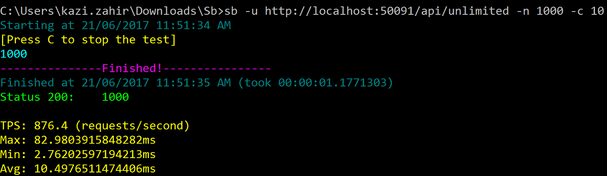
   
and wala all 1000 calls successfully executed with a 200 status		

### 2. Testing the /api/globallylimited/{id} for GET which has a associated policy that allows 5 calls per minute 
   and 8 calls per hour.
   Type **sb -u http://localhost:50091/api/globallylimited/1 -n 1000 -c 10**

		
   
and as excepted 5 calls went through with 200 status while the 995 others got throttled with 429  
 
   Type **sb -u http://localhost:50091/api/globallylimited/2 -n 1000 -c 10** within the same minute

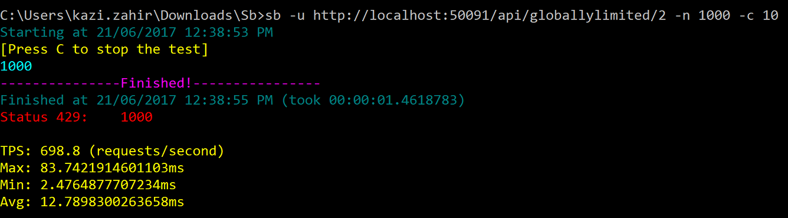	
   
and as excepted all 1000 calls got throttled with 429 as both these url 
fall under the same endpoint **api/globallylimited/\{id\}**

   Now wait for 1 minute to recover the limits and try the same two steps as above. Here is the screentshot for that:

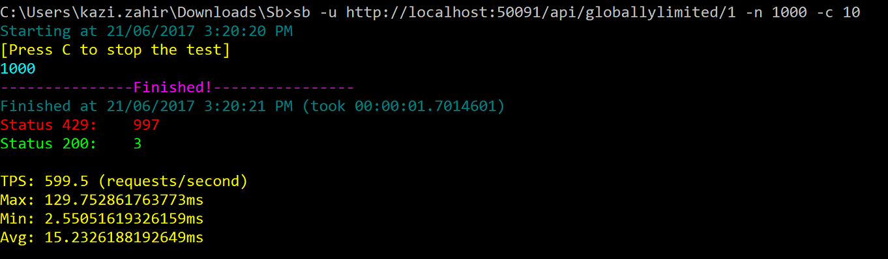	

   Here we see only 3 calls succeeded instead of 5 since this policy 
(named StaticPolicy_0) also enforces a 8 calls per hr limit which was 
exhausted after the first 3 calls were made (5 + 3 = 8)	

   Now that you have exhausted all 8 successful calls for the hour (as enforced by 8 call per hour limit in the policy in
   addition to the 5 calls per minute) if you keep repeating the same steps for a 3rd or 4th time even after wating some minutes but 
   within the same hr, all the requests will get throttled and get a 
   429 status. To get back to the using it we will have to wait for one hour now.

   Here is a screenshot taken after like 3 minutes or so showing still all request throttled as expected.
	
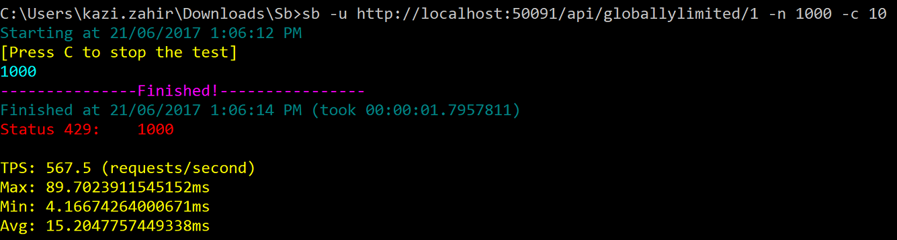	

   One thing that should be discussed here are the headers returned while for successfull requests
	For every succssfull request that is not rate limited it will return the headers
	
* X-RateLimit-Remaining: shows the numbers of calls remaining right after the current call before getting throttled next. Note
                            that for distributed apps this will only give an indication of how many was remaining when that 
			                call was made and not how many will be remaining before the next call is made since by the time the 
			                next call is made there might be 0 calls remaining as they could have been used up my another node. It is
                            mostly to give an idea.
* X-RateLimit-Limit:     shows the limit under which the last call fell under

   For instance restart the redis service to reach a clean state (no calls made so far) and type
       **sb -u http://localhost:50091/api/globallylimited/1 -n 1 -h**

   we get the following

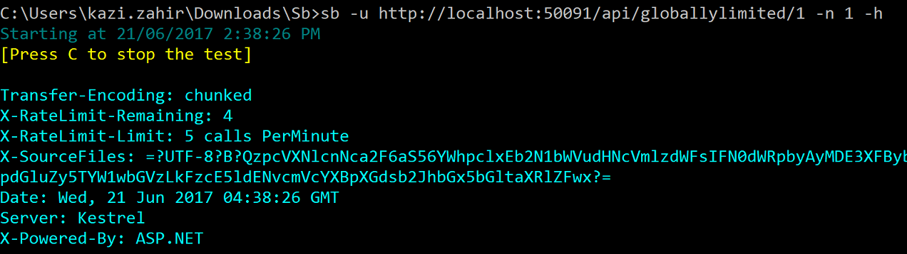		
   
   It shows X-RateLimit-Remaining of 4 and X-RateLimit-Limit of 5 calls PerMinute as expected
   If we do it 4 more times to finish the limit we will see the X-RateLimit-Remaining going down to 0
   Now wait for a minute to let it reset and then do the same five times and again type 
        **sb -u http://localhost:50091/api/globallylimited/1 -n 1 -h**

   Now it shows X-RateLimit-Reamining of 2 and X-RateLimit-Limit of 8 calls PerHour since we will be albe to 
   make 3 more requests before getting throttled by the 8 calls per PerHour limit for the next hr.
   Here is the actual screentshot of the test:

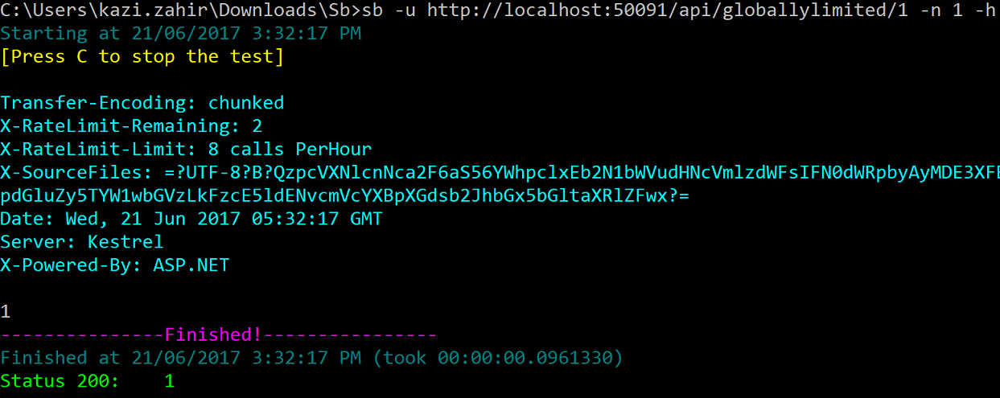	

   
   Now let us talk about the headers sent when request are throttled.
   Again flush the redis db using the Redis Desktop Manager to reach a clean state (no calls made so far) and type
       **sb -u http://localhost:50091/api/globallylimited/1 -n 5** to exhaust the first limit

   Now 	type **sb -u http://localhost:50091/api/globallylimited/1 -n 1 -h** to show the headers
   
Here is the output:

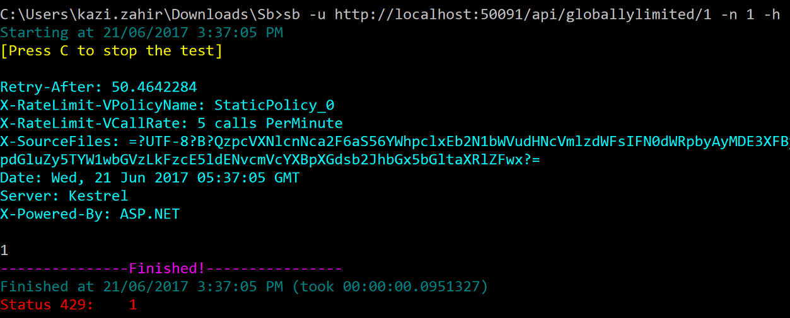	
  
   Notice the headers
	
* Retry-After: which shows the seconds to waits before making the next request
* X-RateLimit-VPolicyName: which gives the name of the policy that was violated or empty for unnamed policies
* X-RateLimit-VCallRate: shows the call rate that was violated within the policy (usefull for multiple call rates in 
                            a single policy)	
			
	
	It tells to retry after 50 seconds and the call was throttled due to violation of StaticPolicy_0 policy for the 
        5 calls PerMinute limit.

   WHooo...that was a lot of things to cover :-)		

### 3. Now we will test the /api/globallylimited GET endpoint 
   For this one no explicit policy has been mentioned so it wiil fall under 
   the general policy with 100 calls per minute that has been set up

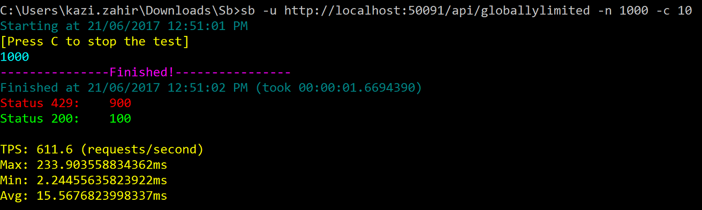
   
   And as expected 100 calls went through and 900 got throttled. Any endpoint has hasn't been explicitly set up with fall under this 
   generic rule.

### 4. Next up we will be exercising the attribute based limiting feature. 
  In the sample project there is an AttributeLimitedController
   which has a attribute limit set on the controller level of 20 calls PerMinute. Now you can ask wouldn't it conflict with the 
   more general route of 100 calls PerMinute which we have already set globally. Notice that when it sets that policy it 
   set the allowAttributeOverride parameter to true which is by default false essentially saying that attributes can override that policy      if they want. Let us give it a go to see it in action.
   Type **sb -u http://localhost:50091/api/attributelimited -n 1000 -c 10**

   and here is the output	

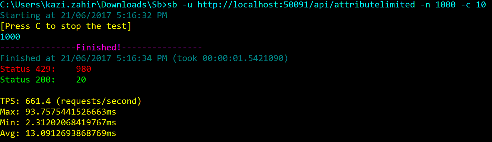
   
   and as expected 20 calls went through and the rest throttled.

   Let us work through another method api/attributelimited/{id} which has its own attribute set to allow 15 calls PerMinite and 
   25 calls PerAHour. The multiple call rates work in the same way for attributes.

   Type **sb -u http://localhost:50091/api/attributelimited/1 -n 1000 -c 10** and following is the output produced as expected:

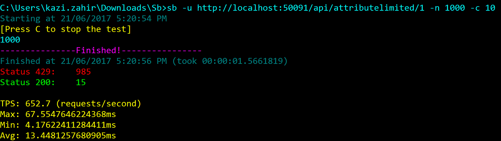
   
   Now within the same minute type 
        **sb -u http://localhost:50091/api/attributelimited/1 -n 1 -h** and here is the result
   

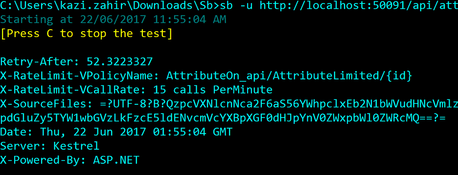

   Notice that in the X-RateLimit-VPolicyName, it says the policy on the attribute on the endpoint api/attributelimited/{id}
   was violated as expected.

### 5. Next we will explore setting up the same global policies using configuration with the help of the RateLimitingOptions.
   For this if we open the appsettings.json file we will find the following:     

    "RateLimitingOptions": {
        "RateLimitingEnabled": true,
        "RateLimitPolicyStrings": [
          "*:GET:api/globallylimited/{id}:5_PerMinute&8_PerHour:true:StaticPolicy_0",
          "*:*:/api/globallylimited/{id}/sub/{subid}:2_PerMinute:true:StaticPolicy_1",
          "*:*:*:100_PerMinute:true:StaticPolicy_2"
        ],
        "RateLimitPolicyOptions": [
          {
            "RouteTemplate": "api/globallylimited",
            "HttpMethod": "POST",
            "AllowedCallRates": {
              "PerMinute": 3
            },
            "Name": "GlobalPostLimit",
            "AllowAttributeOverride": true
          }
        ],
        "RateLimitingWhiteListedPaths": [
          "/api/unlimited"
        ],
        "RateLimitingWhiteListedRequestKeys": [
        ]
    }

  Let us look at end property in detail:

   * RateLimitingEnabled: boolean to enable or disable rate limiting. For instance we might want to set it to false 
                         for local development but update it to true before pushing to staging or production
   
   * RateLimitPolicyStrings: Array of strings containing string representations of policies to set. Each policy string comprises of 
      6 parts delimited by the colon symbol in the form                  
		RequestKey:HttpMethod:RouteTemplate:AllowedCallRates:AllowAttributeOverride:PolicyName

      For example: "*:GET:api/globallylimited/{id}:5_PerMinute&8_PerHour:true:StaticPolicy_0"

      Please note that all 6 parts need to be mentioned to it to be considered a valid policyString otherwise the RateLimitingOptions
      class will throw ArgumentException while parsing it. Use the * symbol to represent for all. All the parts are self explanatory except       for the AllowedCallRates which itself is a & delimited string of call rates of the form Amount_PerDuration where Amount is an       interger and PerDuration is either PerSecond, PerMinute, PerHour or PerDay. For instance the string 10_PerMinute&100_PerHour is a       valid AllowedCallRates section. It can be sometimes helful to just be able to provide string representations of Policies and have       then easily susbtituted to other string values during deployment by the CI/CD pipeline. 

      Policies can also be applied using the more structured RateLimitPolicyOptions property which is an array of RateLimitPolicyOptions       with the properties which are self explanatory and similar to the RateLimitPolicy. 
      
      You can chose to use either format to specify the polices and can even combine the two. At the end of the day the RateLimitingOptions
      class will parse both these properties and expose them together via its own property RateLimitPolicies which is a       IEnumerable<RateLimitPolicy> and can be used in code to access all the polices easily.

      To see all the above discussed point in action please go to the region "Setting Policies Using Configuration Options"
      and uncomment the code there. 

            #region Setting Policies Using Configuration Options
            // var rateLimitingOptions = new RateLimitingOptions();
            // Configuration.GetSection(nameof(RateLimitingOptions)).Bind(rateLimitingOptions);

            // var globalRateLimitingClientPolicyManager = new RateLimitingPolicyManager(
            //        new SampleRateLimitingClientPolicyProvider())
            //    .AddPoliciesForAllEndpoints(new List<AllowedCallRate>() {new AllowedCallRate(180, RateLimitUnit.PerMinute)},name:"ClientPolicy")
            //    .AddPathsToWhiteList(rateLimitingOptions.RateLimitingWhiteListedPaths)
            //    .AddRequestKeysToWhiteList(rateLimitingOptions.RateLimitingWhiteListedRequestKeys);
            #endregion

 Now comment all the code in the region "Setting policies explicitly using code". If we go through the
      same verifications with sb.exe as earlier, we should see the same results.		
	
	

# Setting up multi level rate limiting with multiple request keys

Let us say we want to setup the rate limiting on two levels. Considering a real world scenario that might come up is the need to limit endpoints for all users of an organization on an individual user level and further limt the request on a more general organization level. For instance we might want to set up policies limiting each user of the organization (based on userId) to 100 calls Perminute to the endpoint api/values/{id} and further limiting the same endpoint to 1000 calls PerMinute overall for all users combined of the same organization using organizationId as the request key thus ensuring a fair share of calls on a individual level and a total upper limit on the organization level.

The above requirement can also be achieved by injecting multiple global RateLimitingActionFilter instances each one configured with a different IRateLimitingPolicyProvider instance working with a different request key: one using userId for the requestKey and other using organizationid as the requestKey.

Let us see it in action and verify our expectations: 

First go to the region labelled "Multi Level rate limiting on user and organization - Separate Policy Providers" and observe that two different policy providers are set one on the user level and the other on the organization level. Let us examine the SampleRateLimitingUserPolicyProvider first. 

This sample user policy provider is set to return policies for 3 different users with an allowed call rate of 100 calls PerHour per user. For the first 200 calls it will return a policy of 100 calls PerHour for test_user_01. For the next 200 calls it will simulate for test_user_02 and for the next 200 calls it will behave as if test_user_03 is making the calls. 

Next up is the SampleRateLimitingOrganizationPolicyProvider which set a policy of 200 calls PerHour per organization (for all users of that organization combined)

Let us describe what will happen:

1. For the first 200 calls simulating test_user_01, the first 100 will be go through and the next 100 will be throttled (100 calls PerHour per user)
2. For the next 200 calls simulating test_user_02, again the first 100 will be go through and the next 100 will be throttled (100 calls PerHour per user)
3. For the next 200 calls simulating test_user_03, all the calls will be throttled not by the user policy but by the SampleRateLimitingOrganizationPolicyProvider which is set to allow 200 calls Per Hour for all users of this organization combined.

In order to verify the expected results please go the the region "Multi level rate limiting - Multiple action filters based on separate Policy Providers providing separate policies". Uncomment the two lines adding two separate RateLimitingActionFilter instances and comment the line in the region "Adding the RateLimitingActionFilter" just above it.
